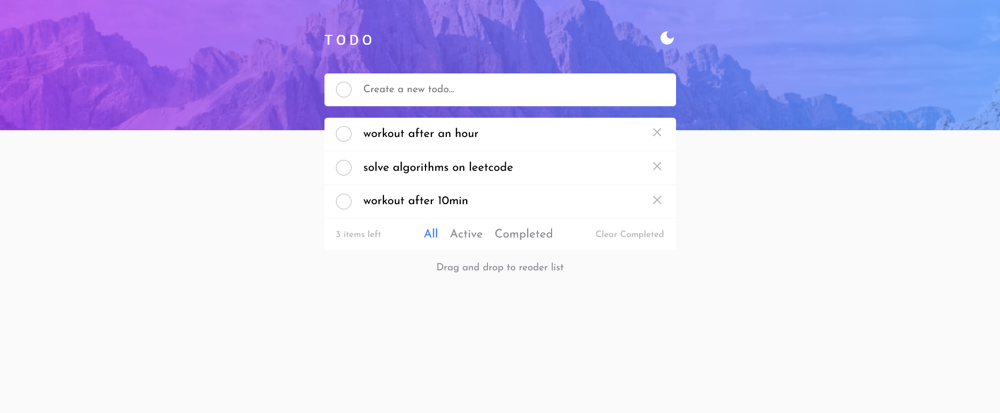

# Frontend Mentor - Todo app solution

This is a solution to the [Todo app challenge on Frontend Mentor](https://www.frontendmentor.io/challenges/todo-app-Su1_KokOW). Frontend Mentor challenges help you improve your coding skills by building realistic projects. 

## Table of contents

- [Overview](#overview)
  - [The challenge](#the-challenge)
  - [Screenshot](#screenshot)
  - [Links](#links)
- [My process](#my-process)
  - [Built with](#built-with)
  - [What I learned](#what-i-learned)
  - [Continued development](#continued-development)
- [Author](#author)

## Overview

### The challenge

Users should be able to:

- View the optimal layout for the app depending on their device's screen size
- See hover states for all interactive elements on the page
- Add new todos to the list
- Mark todos as complete
- Delete todos from the list
- Filter by all/active/complete todos
- Clear all completed todos
- Toggle light and dark mode
- **Bonus**: Drag and drop to reorder items on the list

### Screenshot

### Links

- Solution URL: [View Code](https://github.com/Mzota2/TodoApp)
- Live Site URL: [View Live](https://mzota2.github.io/TodoApp/)

## My process

### Built with

- Semantic HTML5 markup
- CSS custom properties
- Flexbox
- Material UI
- Mobile-first workflow
- [React](https://reactjs.org/) - JS library
- [Styled Components](https://styled-components.com/) - For styles

### What I learned

This project has helped me to understand and implement theme modes of a web application. The app has two modes, light and dark theme. I have also learnt how to work with useContext Hook in ReactJS.

### Continued development

I would like to learn more about Material UI and make it my first choice CSS library in my future projects.

## Author

- Website - [Emmanuel Mzota](https://mzota-portfolio.onrender.com/)
- Frontend Mentor - [@Mzota2](https://www.frontendmentor.io/profile/Mzota2)
- Twitter - [@mzotacodes](https://www.twitter.com/mzotacodes)
- Instagram - [@mzotacodes](https://www.instagram.com/mzotacodes)

